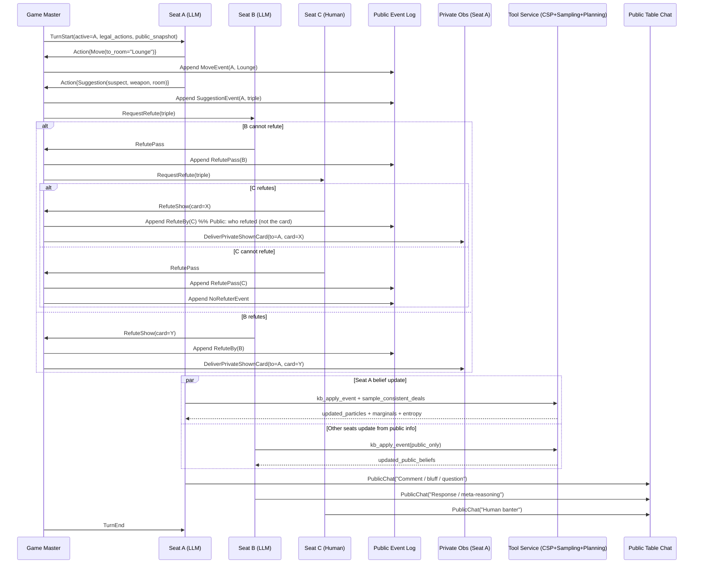
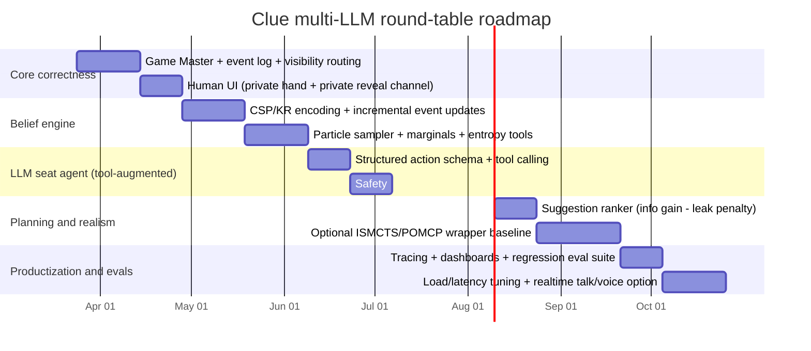

# Part I: Machine Learning Algorithms for Playing Clue: From Simple Inference Agents to Generalized Imperfect-Information Multiagent Systems

## Executive summary

Clue is a turn-based, multiplayer, imperfect-information deduction game whose strategic core is *information management*: each player must update beliefs about (i) the hidden “case file” triple and (ii) who holds which cards, while choosing suggestions that (a) extract new information efficiently and (b) do not leak too much to opponents. The official rules create asymmetric observations (a refuting card is shown privately to the suggester), sequential turn order for refutation, and a one-shot “accusation” action that can eliminate you from winning if wrong—making risk calibration and belief confidence central. citeturn8view0turn8view1

For practical, multiplayer Clue-specific play, the strongest “easy-to-implement” family is **explicit belief-state tracking** (logical constraints + probabilistic estimation via sampling consistent deals) with **information-gain–driven suggestion selection**. This approach is supported by Clue-specific research that combines constraint reasoning with probabilistic estimation (e.g., sampling satisfying deals) and shows the combinatorial explosion that makes exact counting hard, motivating sampling-based probability estimates. citeturn9view0turn9view2turn19view3

For cutting-edge, generalizable agents across many hidden-information, turn-based multiplayer games, today’s most mature toolchains cluster around two paradigms:  
(1) **Game-theoretic / equilibrium-oriented learning** in extensive-form games (CFR/MCCFR, NFSP, PSRO, and newer hybrids) and  
(2) **Belief-aware deep RL + search** (recurrent or explicitly learned belief representations combined with planning/search), with strong demonstrations in imperfect-information benchmarks like poker (DeepStack, Libratus, and later work). However, many of the cleanest theoretical guarantees are for **two-player zero-sum** games; multiplayer/general-sum settings (like Clue with 3–6 players) remain harder, often requiring approximations, population-based evaluation, and careful opponent-modeling assumptions. citeturn1search1turn21search8turn3search30turn3search39turn2search37turn3search4turn28search0

Language note: no programming language was specified; the report is language-agnostic, but many recommended research libraries are primarily **Python/C++** (sometimes with JAX/TensorFlow/PyTorch bindings). citeturn28search4turn4search4turn4search5

## Game formulation and constraints for Clue agents

In the classic rules, Clue contains 6 suspect cards, 6 weapon cards, and 9 room cards; one card from each category is placed into a hidden “case file” envelope, and the remaining cards are dealt to players (not necessarily evenly). citeturn8view1

**Turn structure and observation model (critical for ML design).** On your turn you move to a room (via dice/movement constraints and optional secret passages), then you may make a **suggestion** naming (Suspect, Weapon, Room) where the room must match your current room. Refutation proceeds **in order to your immediate left**: the first player who can refute must show *exactly one* of the named cards **privately** to you (if they have multiple). If a player cannot refute, the chance passes to the next player; if nobody refutes, you may end your turn or make an **accusation**. citeturn8view0turn8view1

**Accusation is an irreversible, high-stakes action.** You may make only one accusation in a game; if incorrect, you cannot win but you remain in play for refuting others’ suggestions. This strongly couples belief calibration (probability of being correct) to utility (expected chance to win before someone else). citeturn8view0

**Multiagent interaction is not just “other players as environment.”** Suggestion outcomes create (i) private evidence for the suggester (the specific card shown) and (ii) public evidence for everyone (who refuted or failed to refute). Further, the rules explicitly allow “self-suggestions” (naming cards you hold) to mislead opponents, meaning optimal play can require *strategic information disclosure control*, not merely maximum information gain. citeturn8view0turn24view2

**Formal models that match Clue.**  
- A single-agent abstraction can treat other players as stochastic responders and model the game as a **POMDP** (hidden state = envelope + all hands; observation = suggestion outcomes), but this collapses strategic opponents into a stationary process. citeturn6search8turn6search0  
- A more faithful model is a **partially observable stochastic game (POSG)** / extensive-form game with private information and sequential actions by multiple agents, capturing that each player has their own observations and policy. citeturn6search5turn28search0  
- Richer “reasoning about others’ beliefs” can be framed via **interactive POMDPs**, explicitly adding models of other agents into the state and belief update. citeturn5search7turn24view2

## Baseline and classical approaches for multiplayer Clue-specific play

**Rule-based heuristics (including “notebook logic” baselines).**  
Description: encode common Clue tactics (track known-not-in-envelope; prefer suggesting unknown triples; prefer cycles among rooms; choose accusation when all but one possibility eliminated; optionally include “deception” heuristics). The rules structure refutation order and private reveals, so heuristics typically treat suggestion selection as an “active query design” problem. Implementation complexity is low; data needs are none. Multiplayer suitability is moderate: heuristics can exploit turn order but often struggle with deliberate deception. Hidden information is handled implicitly via hard rules and elimination. Scalability is excellent but performance potential is limited by handcrafted logic. Tools: any language + a rules engine; for structured experiments, a standard MARL environment API helps. citeturn8view0turn8view1turn4search4

**Logical inference via SAT/CSP (exact deduction when possible).**  
Description: represent statements like “each card is in exactly one place (case file or a player hand)” and “each player hand has fixed size,” then incorporate observations from suggestion/refutation. Clue is a canonical “knowledge game” where propositional constraints capture much of the deduction, and Clue-specific work uses generalized constraints to represent cardinality efficiently, then performs constraint satisfaction to derive provable certainties (places where a card *must* or *cannot* be). Implementation complexity is medium (requires careful encoding and incremental updates). Data needs are none. Multiplayer suitability is high: constraints can incorporate public refutation order and private shown-card information for the acting player. Hidden information is handled exactly (for what is logically entailed). Scalability is good up to solver limits; the hard part is that many states admit combinatorially many consistent deals. Tools: off-the-shelf SAT solvers / CP-SAT / CSP libraries; for teaching-grade Clue SAT reasoning, published Clue-deduction materials exist. citeturn9view0turn15search24turn24view3

**Bayesian inference and belief-state tracking (probabilistic “who-has-what” + envelope posterior).**  
Description: maintain an explicit posterior over hidden deals consistent with observations, updating after each suggestion outcome. In full generality, exact Bayesian updates are intractable due to the number of consistent deals; Clue-specific research therefore estimates probabilities by searching/sampling satisfying deals consistent with the agent’s knowledge base. Implementation complexity is medium; data needs are none; training is optional. Multiplayer suitability is high because beliefs can include “what others know” effects (information leakage). Hidden information is handled directly as a distribution (not just hard elimination). Scalability depends heavily on sampling efficiency and constraint propagation strength. Tools: SAT/CSP for feasibility + Monte Carlo sampling for estimation; optionally probabilistic programming if you prefer explicit Bayes factors, though constraints dominate in Clue. citeturn9view2turn9view3turn24view2

**Monte Carlo sampling over “possible worlds” (determinization / particle sets).**  
Description: maintain a set of sampled complete deals (particles) consistent with observations (a “possible worlds” belief approximation). Choose actions by simulating from each sampled world and averaging utilities (e.g., expected information gain or win probability proxies). Implementation complexity is low-to-medium: easiest if you already have a constraint checker to sample consistent deals. Data needs are none. Multiplayer suitability is moderate to high, but naïve determinization can suffer from “strategy fusion” and non-locality issues in imperfect-information search (choosing actions that implicitly assume knowledge you don’t have). Tools: any Monte Carlo framework; for planning-in-belief, POMDP Monte Carlo methods are relevant. citeturn1search0turn28search1

**MCTS adaptations for hidden information (ISMCTS and variants).**  
Description: Information Set MCTS samples determinizations from the information set and runs MCTS in a way that respects information-set constraints; the ISMCTS paper introduces multiple variants to handle different sources of hidden information/uncertainty. Implementation complexity is medium-to-high (tree structure + belief sampling + rollout policies). Data needs are none. Multiplayer suitability is good in practice (ISMCTS is explicitly for imperfect-information game search), but quality depends on rollout design and how well the method avoids information leakage artifacts. Hidden information is handled via information sets and sampling. Scalability can be strong if you have fast state simulation and can cap computation per move. Tools: implement from the ISMCTS paper or reuse game libraries that already include MCTS primitives. citeturn28search1turn19view3

## Intermediate ML approaches for Clue

**Supervised learning from human play (predict suggestion/accusation choices).**  
Description: treat human gameplay logs as labeled data and train a policy model to predict actions from observable state features (own hand, suggestion history, inferred constraints). This is attractive for “human-like” play and speed, but requires (i) a consistent state representation and (ii) enough diverse gameplay logs; otherwise it overfits to specific styles. Implementation complexity is medium; data needs are moderate to high (depending on model class). Multiplayer suitability is high if you include opponent-dependent features (seat order, inferred hands). Hidden information is handled either by (a) learning directly on partial observations (imitation under partial observability) or (b) training with privileged labels (true deal) for auxiliary tasks (belief learning) while deploying without them. Tools: standard ML stacks plus a robust simulator to generate/query features. citeturn25view2turn28search4

**Imitation learning and dataset aggregation (DAgger-style).**  
Description: behavior cloning is brittle in sequential settings because the learner visits states the expert dataset doesn’t cover; DAgger addresses this by iteratively collecting data under the learner’s current policy and aggregating expert labels on encountered states. For Clue, “expert” can be (i) a strong logic+sampling agent, or (ii) a human-in-the-loop labeling suggestions/accusations, or (iii) an offline oracle agent with privileged access used only during training. Implementation complexity is medium (requires a queryable expert and iterative training loop). Data needs are medium; sample efficiency is better than pure behavior cloning in many sequential tasks. Multiplayer suitability is good if you train against diverse opponent populations. Tools: any supervised stack; DAgger’s formulation is standard and well-cited. citeturn28search3turn28search11turn28search0

**Policy/value networks with belief features (no full RL yet).**  
Description: build a neural policy that consumes (a) handcrafted belief summaries (marginals over envelope cards; per-card ownership probabilities; uncertainty measures like entropy) and outputs suggestion/accusation decisions; train via supervised targets (expert policy) or via bandit feedback (did this suggestion reduce entropy?). Implementation complexity is medium; data needs can be moderate if you self-generate training targets with a strong inference engine. Multiplayer suitability is high if belief features include “what others likely inferred.” Hidden information handling is as good as your belief extractor; the network mainly learns action selection. Tools: any deep learning framework plus a belief engine. citeturn19view2turn19view3turn9view2

**Opponent modeling and “models of models” (I-POMDP-inspired).**  
Description: explicitly represent uncertainty over opponent hands *and* opponent strategies/types, updating beliefs by observing their suggestion patterns and accusation timing. This matches Clue’s strategic layer—suggestions may be chosen to mislead—and provides a principled way to trade off information gain vs. information leakage. Implementation complexity is high for exact solutions (recursive belief nesting is expensive); approximate versions are feasible (finite type sets, shallow modeling). Data needs vary: you can hand-define opponent types or learn them from logs. Multiplayer suitability is strong in principle. Tools: probabilistic programming + approximate planning, or simpler “type inference + best response” approximations. citeturn5search7turn24view2turn8view0

**POMDP / POSG formulations with approximate planning.**  
Description: casting Clue as a POMDP gives a clean belief-update/planning loop; casting as a POSG captures multiple agents. Exact dynamic programming is generally infeasible except for tiny games; practical solutions use sampling-based planning (e.g., POMCP-style belief tree search) or approximate game-theoretic solvers. Implementation complexity is high (modeling + belief update + planner). Data needs can be none (model-based), but computational needs are significant. Tools: modern game research frameworks can represent these games and provide baseline algorithms. citeturn6search8turn6search5turn1search0turn28search0

## Advanced methods for generalized hidden-information, turn-based multiplayer games

**Deep RL with self-play (recurrent policies and partial observability).**  
Description: train an agent end-to-end with RL, using recurrence (LSTM/GRU) to integrate observation history as a proxy belief state. DRQN is an early canonical example of adding recurrence to value-based deep RL for POMDP-like settings. For Clue, this can work in simplified environments (e.g., no board movement) but tends to be sample-hungry and sensitive to non-stationarity in multiagent training. Implementation complexity is high; data needs are primarily environment interaction (self-play millions of episodes). Multiplayer suitability is mixed: independent learning can work, but convergence is fragile in general-sum multiagent games. Tools: scalable MARL frameworks and environment APIs are critical. citeturn5search4turn4search4turn4search5turn28search0

**Belief-aware networks and neural belief trackers (explicit uncertainty representations).**  
Description: replace “implicit belief in an RNN” with architectures trained to represent belief states compactly (predictive belief representations, learned belief embeddings, or auxiliary-state inference losses). These methods aim to produce a representation closer to a Bayes filter’s sufficient statistic, improving planning/action selection under partial observability. Implementation complexity is high; data needs often include either (a) privileged training signals (true state during simulation) or (b) self-supervised predictive objectives. Multiplayer suitability depends on whether beliefs are individual (private) or public (shared). Tools: deep learning frameworks; often combined with search or equilibrium solvers for decision-time robustness. citeturn5search6turn5search22turn19view2

**AlphaZero-style policy/value + search and Polygames-style systems (perfect-info roots, imperfect-info adaptations).**  
Description: AlphaZero’s paradigm (self-play RL + MCTS guided by policy/value nets) is proven in perfect-information games; direct application to imperfect-information games fails unless the search and training targets are defined on appropriate information abstractions (e.g., public belief states). Open-source implementations and systems like Polygames demonstrate AlphaZero-like training pipelines, mostly in perfect-information settings or controlled variants. For Clue, this becomes plausible only after adopting belief/public-state representations and carefully preventing search from exploiting hidden information. Implementation complexity is very high; compute needs are high (GPU and many rollouts). Multiplayer suitability is challenging (multi-player self-play + non-transitive strategy cycles). Tools: game frameworks plus distributed training infrastructure. citeturn2search11turn2search15turn2search22turn5search5

**Game-theoretic equilibrium methods (CFR/MCCFR, Deep CFR, NFSP, PSRO).**  
Description: These methods treat the problem as learning/approximating equilibrium strategies in extensive-form games with imperfect information. CFR is foundational; MCCFR introduces sampling-based regret minimization with theoretical guarantees under standard conditions for two-player zero-sum games; Deep CFR adds function approximation; NFSP combines fictitious self-play with deep RL to approach equilibria; PSRO generalizes population-based iterative game solving and is widely used as a scaffold for multiagent learning dynamics. In Clue-like multiplayer settings, equilibrium concepts exist but are harder (general-sum, >2 players), often requiring approximations and careful evaluation (exploitability is cleanest in 2p0). Implementation complexity ranges from high to very high; compute needs vary (tabular small games vs deep large games). Tools: **entity["organization","OpenSpiel","game research framework"]** is explicitly built to support research across RL, search, and computational game theory, including imperfect-information multiagent games and algorithms. citeturn1search1turn21search8turn3search30turn3search6turn3search39turn28search4

**DeepStack, Libratus, and related imperfect-information poker AIs (search + solving + abstraction).**  
Description: DeepStack demonstrated expert-level heads-up no-limit poker with a combination of decomposition/recursive reasoning and neural components; Libratus and later systems advanced “blueprint + subgame solving + self-improvement” approaches to handle massive imperfect-information game trees. These systems are landmark demonstrations of combining offline computation with online solving/search in imperfect-information games. Their strongest formal guarantees are again tied to two-player zero-sum settings; nevertheless, they provide reusable architectural lessons for Clue: (i) separate “global strategy” from “local refinement,” (ii) make belief/public state a first-class object, (iii) solve subproblems online within a computational budget. citeturn2search37turn3search4turn3search0turn5search5

**Population-based training and evaluation (robustness across opponent mixtures).**  
Description: in multiagent games, “best” policies can be non-transitive and overfit to their training opponents. Population-based training (PBT) co-optimizes a population of agents and hyperparameters, improving training robustness and wall-clock outcomes in several domains. For Clue, PBT is especially relevant when training opponent models, suggestion-style diversity, and “when to accuse” thresholds to avoid brittle policies. Implementation complexity is high (distributed infra); compute needs are high. Tools: distributed RL stacks; PBT is a standardized technique in modern deep learning. citeturn28search2turn28search0turn4search5

**LLM-based Clue agents (emerging, but currently unreliable deductive consistency).**  
Description: very recent work implemented a text-based multi-agent Clue environment as a deductive reasoning testbed and found that current LLM agents struggled to sustain logically consistent multi-turn deductions; in 18 simulated games they observed only four correct wins, and fine-tuning on logic puzzles did not reliably improve performance (sometimes increasing verbosity without precision). This indicates that “reasoning in context” and “stateful belief maintenance” are still weak points for LLM agents without tool-augmented belief tracking. citeturn25view0turn25view2

## Comparative analysis and diagrams

### Comparative table of methods vs key attributes

The qualitative ratings below reflect *typical* outcomes when implemented competently for Clue-like games; they are not guaranteed. The citations in this section ground what each method is designed to do; the ratings are an applied synthesis. citeturn28search1turn1search0turn21search8turn28search0turn5search4turn2search37turn3search4turn28search2

| Method family (Clue-ready) | Impl. complexity | Performance potential | Multiplayer support | Sample efficiency | Interpretability | Hidden-info handling | Cross-game generality |
|---|---|---|---|---|---|---|---|
| Rule-based heuristics | Low | Low–Med | Med | High | High | Low–Med | Low |
| SAT/CSP deduction (exact entailments) | Med | Med–High | High | High | High | High (logical) | Med |
| Bayesian belief tracking + sampling | Med | High | High | Med | Med–High | High (probabilistic) | Med |
| Info-gain / entropy-driven query selection | Med | High | High | Med | High | High (via belief) | Med |
| Determinization / possible-world Monte Carlo | Med | Med | Med | Med | Med | Med | Med |
| ISMCTS (hidden-info MCTS) | High | High | High | Med | Med | High | High |
| POMDP planning (POMCP-like) | High | High | Med | Med | Med | High | High |
| Supervised policy from human logs | Med | Med | High | High (once data exists) | Low–Med | Med | Med |
| Imitation learning (DAgger loop) | High | High | High | Med | Low–Med | Med | High |
| Deep RL with recurrence (DRQN-style) | High | High | Med | Low | Low | Med | High |
| CFR/MCCFR / equilibrium-style solvers | Very High | High (2p0), Med (N-player) | Med–High | Med | Med | High | High |
| DeepStack/Libratus-style online solving | Very High | Very High (2p0) | Low–Med | Med | Low–Med | High | Med–High |
| PSRO / population-based MARL | Very High | High | High | Low–Med | Low–Med | Med | High |

### Flowchart: a practical “belief-first” Clue agent architecture

```mermaid
flowchart TD
  A[Observed events\n(suggestions, refuters, shown card if any)] --> B[Knowledge base update\n(CSP/SAT constraints)]
  B --> C[Belief update\n(sample consistent deals / compute marginals)]
  C --> D[Action scoring]
  D --> E1[Choose suggestion\n(max expected info gain\nminus info leaked)]
  D --> E2[Choose movement\n(to reach informative rooms)]
  D --> E3[Choose accusation\n(if posterior confidence high\nand risk justified)]
  E1 --> A
  E2 --> A
  E3 --> F[Terminal (win/lose)]
```

This architecture directly reflects that the key state in Clue is an evolving *information set* (all hidden deals consistent with what you know), and that strong play optimizes how actions reduce that set while managing what opponents infer. citeturn8view0turn9view2turn28search1turn19view3

## Development roadmap with milestones, effort, and resources

Effort estimates below assume one experienced engineer/researcher; teams can parallelize (environment + inference + learning). Compute assumptions: CPU for inference/search prototypes; one or more GPUs once deep models/self-play enter. citeturn28search0turn4search5turn4search4turn28search2

```mermaid
gantt
  title Clue agent roadmap (prototype -> generalized imperfect-info agent)
  dateFormat  YYYY-MM-DD
  axisFormat  %b %d

  section Foundations
  Rules engine + simulator (full Clue turn loop)     :a1, 2026-03-24, 14d
  Logging + reproducible eval harness                 :a2, after a1, 7d

  section Strong non-ML baseline
  Constraint KB (SAT/CSP) + incremental updates       :b1, after a2, 21d
  Belief sampling + marginals + entropy metrics       :b2, after b1, 21d
  Suggestion policy: info gain + leak penalty         :b3, after b2, 14d

  section Search layer
  ISMCTS or belief-MCTS prototype                      :c1, after b3, 28d
  Performance tuning: rollouts, caching, pruning       :c2, after c1, 21d

  section Learning layer
  Expert-data generation (self-play with baseline)     :d1, after c2, 14d
  Supervised policy/value model on belief features     :d2, after d1, 21d
  DAgger-style improvement loop                         :d3, after d2, 21d

  section Generalization + MARL robustness
  Swap environment API to MARL standard + wrappers     :e1, after d3, 14d
  Population-based training + evaluation                :e2, after e1, 28d
  OpenSpiel integration / benchmarking                  :e3, after e1, 28d
```

### Milestones and recommended resources

**Milestone: a correct, testable Clue environment.** Prioritize determinism, fast simulation, and full logging of (a) public events and (b) each player’s private observations. Without this, neither sampling-based inference nor ML training will be reliable. (Rules source for correctness: Hasbro instructions.) citeturn8view0turn8view1

**Milestone: inference core (CSP/SAT + sampling).** Aim for (1) fast propagation of certainties and (2) efficient sampling of consistent deals for probabilistic estimates. This matches proven Clue-specific approaches that combine constraint satisfaction with probabilistic estimation by sampling satisfying deals. citeturn9view0turn9view2

**Milestone: decision policy using explicit uncertainty reduction.** Information-entropy / information-gain criteria provide an interpretable objective for query selection; this aligns with entropy-based deduction-game search formulations and with Clue work emphasizing information utility considerations (including knowledge given to opponents). citeturn19view0turn24view2turn11search8

**Milestone: add planning.** Start with ISMCTS for imperfect-information search (robust baseline) before attempting heavy deep RL. ISMCTS is explicitly designed for games with hidden information and uncertainty. citeturn28search1

**Milestone: learning and generalization.** Once you have a strong non-ML agent, use it as (a) a training data generator for supervised/DAgger loops and (b) a stable evaluation opponent. DAgger is specifically designed for sequential decision-making settings where naïve behavior cloning fails under distribution shift. citeturn28search3turn28search11

**Milestone: multiagent robustness.** Use population-level training/evaluation (PBT or PSRO-style populations) to avoid overfitting to a narrow opponent set. PBT is a standard approach for robust training/hyperparameter schedules in deep learning (including deep RL). citeturn28search2turn3search39

### Recommended libraries and tools (practical choices)

- **entity["organization","OpenSpiel","game research framework"]**: broad set of games and algorithms spanning RL, search, and computational game theory; supports imperfect information and multiagent settings; useful for benchmarking and reusing implementations of CFR-family methods and more. citeturn28search0turn28search4  
- **entity["organization","PettingZoo","marl environment api"]** (AEC API) for turn-based multi-agent environments; helpful if you will train MARL algorithms outside OpenSpiel. citeturn4search0turn4search4  
- **entity["organization","Ray","distributed computing framework"] RLlib for scalable MARL training configurations (turn-based or simultaneous). citeturn4search1turn4search5  
- **entity["organization","Gymnasium","reinforcement learning api"] for standard RL environment interfaces (often used as substrate tooling). citeturn4search2turn4search22  
- SAT/CSP tooling (language-dependent): a SAT solver or CP-SAT engine is highly recommended given how naturally Clue maps to hard constraints. citeturn9view0turn15search24

### Suggested datasets, code repositories, and primary sources (links)

```text
Official rules (Hasbro):
- https://www.hasbro.com/common/instruct/clueins.pdf

Clue/Cluedo formal knowledge/action modeling:
- https://cs.otago.ac.nz/research/publications/OUCS-2001-02.pdf  (game actions in Cluedo)

Clue-specific logical+probabilistic reasoning:
- https://cs.gettysburg.edu/~tneller/papers/icgaj18-clue.pdf

ISMCTS (hidden-information MCTS):
- https://eprints.whiterose.ac.uk/id/eprint/75048/1/CowlingPowleyWhitehouse2012.pdf

OpenSpiel (framework + paper):
- https://arxiv.org/abs/1908.09453
- https://arxiv.org/pdf/1908.09453

POMCP (Monte Carlo planning in POMDPs):
- https://jmlr.org/papers/v11/silver10a.html

Core imperfect-information poker systems:
- DeepStack: https://www.semanticscholar.org/paper/DeepStack%3A-Expert-level-artificial-intelligence-in-Moravc%C3%ADk-Schmid/a2155552ca5afb784a3c1d67a5bcbd4e688b6e05
- Libratus (Science PDF mirror): https://noambrown.github.io/papers/17-Science-Superhuman.pdf

Key learning paradigms:
- DAgger: https://www.cs.cmu.edu/~sross1/publications/Ross-AIStats11-NoRegret.pdf
- PBT: https://arxiv.org/abs/1711.09846

Recent Clue as LLM reasoning testbed (2026):
- https://arxiv.org/html/2603.17169v1
```

(For a single “most practical” starting point: implement the CSP/SAT knowledge base + sampling-based marginals + entropy-driven suggestion selection first; it yields a strong agent before deep learning, and it produces structured training data for later imitation/RL.) citeturn9view0turn19view3turn28search1

# Part II: Real-Time Multi-LLM Round-Table Architecture for Clue

## Executive summary

A do-able, robust multi-LLM “round-table” for Clue should be engineered as **a deterministic, event-sourced game system** with **strict information partitioning** (public vs per-player private), and only then augmented with LLM-driven dialogue and decision-making. Clue’s rules create asymmetric observations—especially that a refuting card is shown **only** to the suggesting player, and refutation happens in **turn order**—so an architecture that treats “conversation history” as the source of truth will drift and leak information. The safest pattern is: **a code-controlled Game Master** commits authoritative game events, and each agent/human receives a filtered view. citeturn2search0turn2search12

To build strong play that matches prior Clue ML findings, keep LLMs **out of the exact deduction loop** and instead couple them to: (1) a **CSP/SAT-style constraint knowledge base + particle (possible-world) sampling** to estimate marginals in the space of consistent deals (as in Clue-specific mixed logical/probabilistic reasoning), and (2) a **planning layer** such as ISMCTS or POMCP-style belief-tree search for action selection under partial observability. citeturn2search1turn2search2turn2search7

For real-time interaction, separate concerns:
- **Game turns** (move / suggest / accuse) should use **structured outputs + tool calling** so the system can validate actions and reliably parse decisions. citeturn3view2turn3view3  
- **Live table talk** and/or voice can use streaming or realtime transports, but you must enforce **guardrails** and **channel separation** to prevent accidental disclosure of private state. citeturn7view0turn8view0

Implementation can be language-agnostic (no language was specified), but the most mature off-the-shelf orchestration stacks are currently Python/TypeScript-centric: **entity["company","OpenAI","ai api provider"] Agents SDK** for tool use, guardrails, encrypted session memory, tracing, and realtime sessions; **entity["company","LangChain","llm tooling company"] LangGraph** for durable stateful orchestration and human-in-the-loop; and (optionally) **OpenSpiel**/**PettingZoo** as environment interfaces for simulation and evaluation. citeturn5view0turn6view0turn4view0turn4view2turn0search6

## Clue mechanics that dictate architectural constraints

Clue’s mechanics impose **hard requirements** on how you store and route information:

**Hidden state.** One suspect, one weapon, and one room card are placed in a concealed Case File; the remaining cards are dealt to players. citeturn2search0turn2search12

**Suggestion + refutation ordering.** After a suggestion, refutation is checked **in player order** (to the suggester’s left, onward). The first player able to refute must show **exactly one** matching card, and that card is shown **only to the suggesting player, privately**. citeturn2search0turn2search12

**Accusation is commitment under uncertainty.** Accusation is effectively a high-stakes “final answer” action; an incorrect accusation eliminates the player from winning (they may remain to refute). citeturn2search20turn2search0

**Implications for LLM round-tables.**
1. You must model the game as an **event log with visibility scopes**, not as a single shared chat transcript, because private reveals cannot appear in public memory. citeturn2search12  
2. Each agent needs a **belief engine** whose internal state is *not* fully exposed to the LLM prompt; otherwise, context overflow and leakage risks are structural. citeturn7view2turn3view2  
3. Strong Clue play is primarily **constraint satisfaction + probabilistic estimation over consistent deals**, rather than purely neural reasoning; Clue-specific research explicitly formalizes this via pseudo-Boolean constraints and sampling consistent deals (“samples”) to estimate probabilities. citeturn2search1turn2search5  

## System-level architecture for a real-time round-table

A practical design is a **Game Master + event store + per-seat agent runtime** with strict public/private routing.

### Reference architecture

```mermaid
flowchart LR
  GM[Game Master\n(rule engine + turn arbiter)] -->|public events| PUB[(Public Event Log\nappend-only)]
  GM -->|private obs| PRIV1[(Private Log: Seat A)]
  GM -->|private obs| PRIV2[(Private Log: Seat B)]
  GM -->|private obs| PRIVH[(Private Log: Human Seat)]

  PUB --> BUS[Pub/Sub + Snapshot Cache]
  PRIV1 --> A[LLM Agent A Runtime\n(private belief + tools)]
  PRIV2 --> B[LLM Agent B Runtime\n(private belief + tools)]
  PRIVH --> UI[Human UI\n(private hand + reveals)]

  A -->|tool calls| TOOLS[Tool Services\nCSP/SAT + sampling\nISMCTS/POMCP\nrisk scoring]
  B -->|tool calls| TOOLS

  A -->|public talk| CHAT[(Public Table Chat)]
  B -->|public talk| CHAT
  UI -->|public talk| CHAT

  OBS[Tracing + Audit + Eval Logging] <-->|spans/events| GM
  OBS <-->|spans/events| A
  OBS <-->|spans/events| B
```

This partition matches capabilities in the OpenAI Agents SDK: tools + orchestration patterns, local vs LLM-visible context, guardrails, and built-in tracing of generations/tool calls/handoffs. citeturn5view0turn7view2turn9view0

### Synchronization model and latency targets

A turn-based board game wants **deterministic synchronization** for correctness, but “round-table talk” wants low-latency streaming. Implement both:

**Turn pipeline (strict, synchronous).**
- Game Master opens the turn for `active_seat`.
- The seat’s agent (or human UI) submits a structured action.
- Game Master validates legality, commits events, and routes observations.
- Agents update beliefs asynchronously (tools), but the chosen action must be committed within a budget.

**Talk pipeline (soft real-time, asynchronous).**
- Public chat is appended as events (or separate stream) and can be interleaved with turns.
- Crucially, talk messages must be treated as *non-authoritative* with respect to the game state.

OpenAI’s function/tool calling pattern is built around the model emitting tool calls (with JSON arguments) and your application executing and returning tool outputs. citeturn3view3 For schema reliability (especially action selection), structured outputs are explicitly designed to guarantee JSON Schema adherence. citeturn3view2turn0search12

**Real-time (voice/streaming) option.** If you need a continuous realtime channel, the Agents SDK’s realtime layer keeps a long-lived connection open so models can process incremental inputs, stream outputs, call tools, and handle interruptions without a fresh request each turn. citeturn8view0 The same documentation also notes a key constraint: **structured outputs are not supported** for realtime agents, so action selection in realtime mode should be gated by code validation and/or a separate structured “turn decision” call. citeturn8view0turn3view2

### Sync vs async architectures (compact comparison)

| Design choice | When it works best | Complexity | Latency behavior | Primary failure mode |
|---|---|---:|---|---|
| Synchronous, code-arbitrated turns (recommended baseline) | Competitive play, correctness-first | Medium | Predictable per-turn budget | Agents feel less “chatty” unless talk is decoupled |
| Hybrid: sync turns + async talk (recommended) | Human-like table feel + correctness | Medium–High | Responsive talk; bounded turn decisions | Desynchronization if agents treat chat as authoritative |
| Fully async, agent-driven arbitration (not recommended early) | Experiments in free-form play | High | Unpredictable | Race conditions, illegal moves, privacy leaks |

This aligns with OpenAI’s own orchestration framing: LLM-driven orchestration is flexible, while code-driven orchestration is more deterministic in speed/cost/performance. citeturn5view0

## Agent internals for LLM seats

Each LLM “seat” should be a composite agent whose **decision core is tool-augmented**, with the LLM focusing on (a) communicating and (b) selecting among tool-scored actions.

### Internal modules

Below is an implementation-oriented decomposition; “data/training needs” assumes you are not fine-tuning initially.

| Module | Description | Impl. complexity | Data/training needs | Latency/compute | Common failure modes | Recommended tools/libraries |
|---|---|---:|---|---|---|---|
| Persona module | Stable style, goals, and “voice”; also sets bluffing/verbosity policy | Low | None (prompting) initially | Negligible | Persona drift; unsafe disclosure | Structured prompts; optional fine-tune later citeturn3view2 |
| Dialogue manager | Produces public table talk, asks clarifying questions (for humans), summarizes | Medium | Optional: conversation examples | Typically LLM-bound | Hallucinated “facts”; accidental leakage | Guardrails + schema-gated talk intents citeturn7view0turn3view2 |
| Belief tracker (CSP + particles) | Maintains constraints and samples consistent deals; outputs marginals/entropy | Medium–High | None (model-based) | CPU-bound; scalable via caching | Inconsistent constraints; particle degeneracy | SAT/CSP solver + sampling as in mixed logical/probabilistic Clue reasoning citeturn2search1turn2search5 |
| Opponent model (lightweight) | Tracks refuter choices, suggestion style; maintains “type” hypotheses | Medium | Optional logs | Low–Medium | Overfitting; non-stationary opponents | Start heuristic; later learn from logs |
| Planner/selector | Ranks candidate moves/suggestions/accusations using info gain + risk + (optional) ISMCTS/POMCP | High | None initially | Variable (budgeted search) | Strategy fusion; compute blow-up | ISMCTS for imperfect info search; POMCP for belief planning citeturn2search2turn2search7 |
| Tool interface | Exposes solver/sampler/planner APIs to the LLM (function calling) | Medium | None | Low overhead | Invalid tool args; tool spam | OpenAI function calling + tool schemas citeturn3view3 |
| Memory | Separates “public narrative memory” from private state and belief | Medium | None | Depends on store | Prompt bloat; leakage via memory injection | Local context not sent to model + encrypted session storage citeturn7view2turn6view0 |

### Private vs public state: a concrete pattern that reduces leakage

Use a **two-tier memory strategy**:

1. **Local/private objects (never sent to the model).** Store full CSP constraints, particle sets, and raw private observations in a “local context” object. The Agents SDK explicitly distinguishes local context (available to code/tools) from LLM-visible context. citeturn7view2  
2. **LLM-visible summaries (only what the seat is allowed to know).** Inject only compressed belief summaries (e.g., top-`k` hypotheses, marginal entropies) and private observations that are legally known by the seat (their hand and cards they personally saw).  

For persistence with confidentiality and controlled retention, the Agents SDK includes an `EncryptedSession` wrapper that provides transparent encryption, per-session keys, and TTL-based expiration. citeturn6view0

### Persona fine-tuning vs prompt engineering

Prompt engineering is the default for early milestones; fine-tuning becomes attractive only after you have stable logs, guardrails, and evaluation metrics.

| Approach | Advantages | Disadvantages | Data requirement | Best use in Clue round-table |
|---|---|---|---|---|
| Prompt engineering (persona instructions + few-shot) | Fast iteration; no training pipeline; easy A/B | Can be brittle; drift across long sessions | None | Phase 1–2: establish safety + correctness |
| Fine-tuning persona/style | More consistent voice; potentially less prompt overhead | Requires curated data; regression risk; harder rollout | Moderate labeled dialogue | Phase 3+: “house personalities” once gameplay is stable |
| Hybrid: prompt persona + fine-tune “talk intent” extractor | Keeps decision correctness tool-driven; stabilizes communication | Two-model complexity | Moderate | When leakage risk demands tighter natural language constraints |

Structured outputs can support the hybrid approach by forcing the model to emit a schema like `{talk_intent, forbidden_claims_check}` rather than raw prose, strengthening validation loops. citeturn3view2turn10search9

## Tool design and API schemas

Clue is a near-perfect fit for “LLM + tools” because deduction and planning can be made **deterministic, testable, and auditable**. ReAct-style patterns specifically motivate interleaving reasoning with tool actions to reduce hallucination and improve control. citeturn1search2turn3view3

### Tool portfolio (core set)

| Tool | Purpose | Complexity | Training needs | Latency/compute | Failure modes | Key references |
|---|---|---:|---|---|---|---|
| `kb_apply_event` | Update CSP/SAT constraints from a new event | Medium | None | Low CPU | Buggy encodings; missed constraints | Clue mixed logical/probabilistic reasoning citeturn2search1 |
| `sample_consistent_deals` | Particle filter / MCMC / rejection sample deals consistent with constraints | Medium–High | None | Medium CPU (budgeted) | Particle collapse; slow sampling | “Sample solutions” concept in Clue paper citeturn2search5turn2search1 |
| `compute_marginals_entropy` | Convert particles to marginals, entropy, info gain estimates | Medium | None | Low–Medium CPU | Miscalibration if particles biased | Standard from sampling pipeline citeturn2search1 |
| `suggestion_ranker` | Score candidate suggestions by expected info gain minus “leakage” | Medium | None | Low–Medium CPU | Over-optimizes info gain; ignores deception | Motivation from Clue info management citeturn2search1 |
| `ismcts_plan` | Plan under imperfect information using ISMCTS variants | High | None | Medium–High (budgeted) | Strategy fusion; rollout bias | ISMCTS paper citeturn2search2turn2search14 |
| `pomcp_plan` | Belief-tree planning from simulator only (POMCP) | High | None | Medium–High (budgeted) | Poor rollout policy; belief mismatch | POMCP paper citeturn2search7turn2search3 |
| `accusation_risk` | Compute probability accusation is correct + EV threshold given game stage | Medium | None | Low | Wrong thresholds; ignores opponent timing | Clue’s irreversible accusation stakes citeturn2search0 |

### Message formats and API schemas (JSON)

All envelopes below assume an **append-only event log** as the backbone. For action selection in non-realtime mode, you can enforce these schemas with structured outputs. citeturn3view2turn3view3

#### Shared context update (public event)

```json
{
  "type": "PublicGameEvent",
  "schema_version": "1.0",
  "game_id": "clue_2026_03_24_abcdef",
  "event_id": "evt_000123",
  "ts": "2026-03-24T19:41:05.123Z",
  "turn": {
    "turn_index": 17,
    "active_seat": "seat_scarlet"
  },
  "visibility": "public",
  "payload": {
    "event_kind": "SuggestionMade",
    "by_seat": "seat_scarlet",
    "triple": {
      "suspect": "Mr. Green",
      "weapon": "Wrench",
      "room": "Lounge"
    }
  }
}
```

#### Private observation delivery (one-seat only)

```json
{
  "type": "PrivateObservation",
  "schema_version": "1.0",
  "game_id": "clue_2026_03_24_abcdef",
  "obs_id": "obs_000045",
  "ts": "2026-03-24T19:41:07.882Z",
  "to_seat": "seat_scarlet",
  "visibility": "private",
  "payload": {
    "obs_kind": "RefutationCardShown",
    "refuter_seat": "seat_mustard",
    "shown_card": { "category": "weapon", "name": "Wrench" },
    "source_event_id": "evt_000124",
    "retention": { "class": "encrypted", "ttl_seconds": 86400 }
  }
}
```

The retention hint maps naturally onto encrypted session storage with TTL semantics. citeturn6view0

#### Tool call and response (application-side tools)

OpenAI’s tool calling model is: model emits a tool call with JSON args → your system executes tool → returns tool output keyed to the tool call. citeturn3view3

Tool call (as your internal normalized format):

```json
{
  "type": "ToolInvocation",
  "schema_version": "1.0",
  "call_id": "call_7f0c9d",
  "seat": "seat_scarlet",
  "tool_name": "compute_marginals_entropy",
  "args": {
    "particle_set_id": "particles_seat_scarlet_t17",
    "compute": ["envelope_marginals", "card_owner_marginals", "entropy"],
    "top_k": 10
  },
  "budget": { "max_ms": 150 }
}
```

Tool response:

```json
{
  "type": "ToolResult",
  "schema_version": "1.0",
  "call_id": "call_7f0c9d",
  "ok": true,
  "result": {
    "envelope_top": [
      { "suspect": "Mr. Green", "weapon": "Wrench", "room": "Lounge", "p": 0.31 },
      { "suspect": "Mrs. Peacock", "weapon": "Wrench", "room": "Lounge", "p": 0.12 }
    ],
    "entropy": { "envelope_bits": 2.41 },
    "calibration_hint": { "particle_count": 5000, "ess": 2100 }
  },
  "timing": { "elapsed_ms": 42 }
}
```

#### Agent-to-agent message (public round-table talk)

Treat talk as events too, with explicit scope:

```json
{
  "type": "ChatMessage",
  "schema_version": "1.0",
  "game_id": "clue_2026_03_24_abcdef",
  "msg_id": "msg_00991",
  "ts": "2026-03-24T19:41:10.010Z",
  "from": { "kind": "seat", "id": "seat_scarlet" },
  "channel": "public_table",
  "content": {
    "format": "text",
    "text": "Interesting—no one could refute that? Noted."
  },
  "safety": {
    "requires_no_private_claims": true,
    "policy_tags": ["no-card-ownership-assertions"]
  }
}
```

To enforce “no private claims,” attach an output guardrail that checks agent output before it is posted publicly. citeturn7view0turn9view1

### Full-turn mermaid sequence diagram (move → suggest → refute → private reveal → belief updates → discussion)



## Coordination, safety, and consistency controls

### Turn arbitration and refutation mechanics

Implement turn logic strictly in the Game Master, not in LLM prompts. The Game Master must:
- Enforce legal movement and suggestion constraints (room must match current room under classic rules). citeturn2search0  
- Iterate refutation requests in the correct order and stop at the first refuter. citeturn2search0turn2search12  
- Deliver the shown card **only** to the suggesting seat via a private channel. citeturn2search12  

### Preventing private-information leakage

A workable “defense-in-depth” stack:

**Channel separation by construction.**
- Private observations never enter the public log, and are stored per-seat (optionally encrypted with TTL). citeturn6view0turn2search12  
- The agent’s full belief state lives in local context objects not sent to the LLM. citeturn7view2  

**Schema-gated outputs for actions and (optionally) for talk intents.**
- Use structured outputs to force the seat agent to emit `{action, rationale_private, talk_intent}` where `rationale_private` is never published. citeturn3view2  
- If running in realtime mode (where structured outputs are not supported), gate by code-level validators and/or a separate non-realtime structured “submit_action” call. citeturn8view0turn3view2  

**Guardrails for public outputs and tool usage.**
- Output guardrails can check agent output before posting; tool guardrails can wrap *every* function-tool call. citeturn7view0turn7view1  
- In practice, implement a “no-ownership-assertion” checker that flags text claiming hidden ownership (e.g., “Colonel Mustard has the Wrench”) unless it has been made public by explicit game mechanics (which classic Clue largely does not). The guardrails system is explicitly designed to run checks and block workflows (or tripwires) before expensive steps. citeturn7view0  

### Audit logs, tracing, and sensitive data hygiene

For rigorous debugging and post-mortems, log both:
- **Game events** (the authoritative event store), and
- **Agent traces** (LLM generations, tool calls, guardrails, handoffs).

The Agents SDK includes built-in tracing that records LLM generations, tool calls, handoffs, and guardrails, and supports the concept of traces and spans. citeturn9view0turn9view1 It also explicitly warns that generations/tool spans may contain sensitive data and provides controls like `trace_include_sensitive_data` to disable capturing sensitive inputs/outputs. citeturn9view1

## Development roadmap and evaluation plan

### Milestones with effort and compute (person-weeks)

Assume 1–2 engineers; add 1 researcher if you pursue planning/self-play later.



Compute guidance:
- Phases a–c: mostly CPU + standard LLM inference.
- Sampling and search (b2, d2): CPU heavy; parallelize across cores; consider time budgets per move (e.g., 100–500 ms for sampling refresh; 500–1500 ms for MCTS), with early cutoffs and cached particles.

### Testing and evaluation metrics

A rigorous evaluation should score both **gameplay quality** and **agent behavior quality**.

**Gameplay metrics (per seat and per match).**
- **Win-rate** against fixed baselines and mixed populations. (Use multiple opponent sets to avoid overfitting.)
- **Accusation precision/recall**: treat each accusation as a predicted triple; precision = fraction correct; recall = fraction of games where the agent eventually makes a correct accusation before losing.
- **Belief calibration**:  
  - **Brier score** on the agent’s predicted probability of the true case-file triple;  
  - **Log-likelihood (negative log probability)** of the true triple under the belief distribution.  
  Calibration directly tests whether the particle approximation and scoring are well-behaved.

**Behavioral metrics.**
- **Conversational naturalness**: human ratings and/or LLM-as-judge rubrics (with strict prompts and held-out test sets).
- **Persona fidelity**: consistency of tone and role constraints across long sessions; measure by rubric graders.
- **Leakage rate**: number of guardrail trips, plus manual audits of public chat for hidden-ownership disclosures.

OpenAI provides an Evals API guide and cookbook patterns for evaluating stored responses and structured-output behavior, enabling regression testing as models/prompts change. citeturn10search5turn10search0turn10search9 For agent workflows, trace grading guidance explicitly connects traces to grader-based evaluation in the dashboard. citeturn10search8turn9view0

### Recommended primary sources and code repositories

The following are especially relevant because they define either (a) Clue deduction formalisms, (b) imperfect-information planning baselines, or (c) production-grade agent/tool orchestration mechanisms:

```text
Clue rules (mechanics, private reveal, refutation order):
- https://www.hasbro.com/common/instruct/clueins.pdf

Clue belief + constraints + sampling (mixed logical/probabilistic):
- https://cs.gettysburg.edu/~tneller/papers/icgaj18-clue.pdf

ISMCTS (imperfect-information MCTS):
- https://eprints.whiterose.ac.uk/id/eprint/75048/1/CowlingPowleyWhitehouse2012.pdf

POMCP (belief-tree planning in large POMDPs):
- https://proceedings.neurips.cc/paper/2010/file/edfbe1afcf9246bb0d40eb4d8027d90f-Paper.pdf

OpenAI tool calling + structured outputs + evals:
- https://developers.openai.com/api/docs/guides/function-calling/
- https://developers.openai.com/api/docs/guides/structured-outputs/
- https://developers.openai.com/api/docs/guides/evals/
- https://developers.openai.com/cookbook/examples/evaluation/use-cases/responses-evaluation/

OpenAI Agents SDK (orchestration, guardrails, tracing, encrypted sessions, realtime):
- https://openai.github.io/openai-agents-python/
- https://github.com/openai/openai-agents-python

LangGraph / LangChain (stateful orchestration, agent/tool patterns):
- https://docs.langchain.com/oss/python/langgraph/overview
- https://github.com/langchain-ai/langgraph

OpenSpiel (game framework, imperfect-info tooling):
- https://github.com/google-deepmind/open_spiel
- https://arxiv.org/abs/1908.09453

PettingZoo (turn-based multi-agent env API):
- https://pettingzoo.farama.org/api/aec/
- https://github.com/Farama-Foundation/PettingZoo

Multi-agent LLM orchestration research (useful design patterns, not Clue-specific):
- https://arxiv.org/abs/2308.08155  (AutoGen)
- https://arxiv.org/abs/2303.17760  (CAMEL)
- https://arxiv.org/abs/2210.03629  (ReAct)
```

Notes on these recommendations:
- OpenSpiel supports n-player, imperfect-information games and provides algorithms and analysis tooling, with a C++ core exposed to Python. citeturn4view3turn0search6  
- PettingZoo’s AEC API is explicitly designed for sequential turn-based multi-agent environments, aligning well with Clue’s turn cycle. citeturn4view2turn0search7  
- Multi-agent conversation frameworks like AutoGen and role-playing agent societies like CAMEL provide reusable orchestration ideas for how LLM agents communicate and collaborate, including human participation. citeturn1search0turn1search33turn1search1